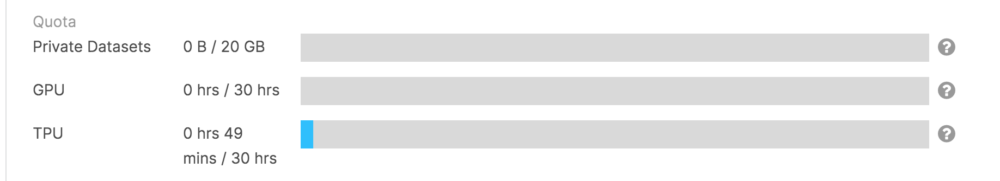
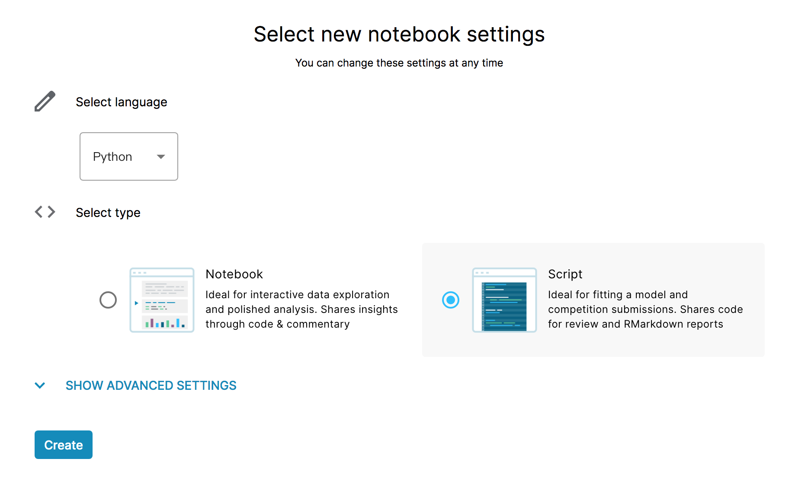
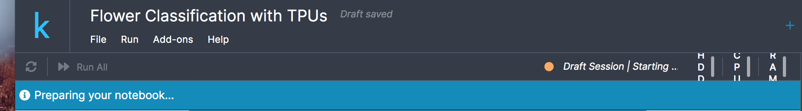
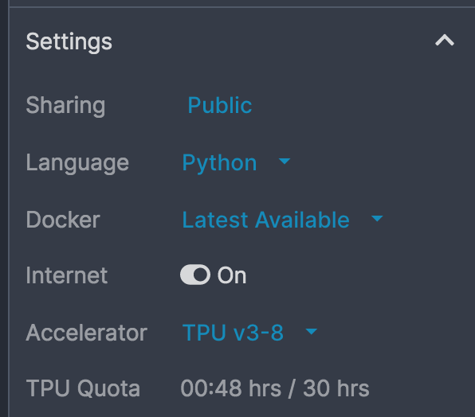
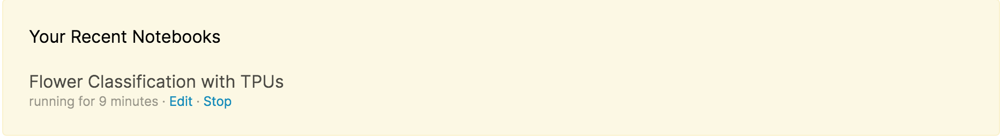
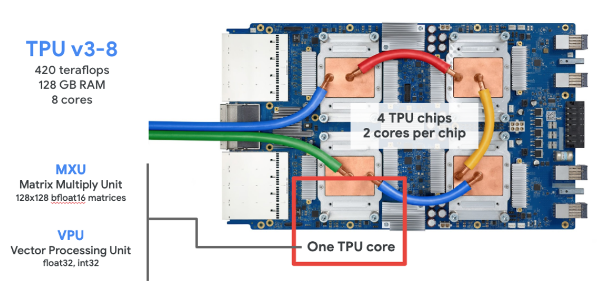

# 机器学习比赛－kaggle
kaggle.com是一个著名的机器学习/数据挖掘比赛项目平台，kaggle现已被谷歌收购。

# 参与kaggle比赛
现阶段，做机器学习和数据挖掘比赛都需要大量的计算资源，普通用户使用本地资源进行比赛，并获得好成绩已不太可能 ，并且，比赛最重要的是算法，而不应该是计算资源，我觉得基于以上考虑，以及云计算的发展，再加上谷歌的支持，kaggle提供了一定的资源，供用户参与比赛。

# notebook功能
可以使用kaggle上的notebook功能，使用python或R语言编写训练代码，kaggle给每个用户分配了一定的计算资源。

## 使用资源
当前，对于每个用户，一周有30h的GPU使用时间和30h的TPU使用时间，可以上传20G大小的个人数据集，相对是很充裕的。

右上角自己的图表，并点击My Account可以查看本周还可以使用的资源总量，如下图：

## 创建notebook
左侧菜单栏，点击Notebooks，右侧New Notebook按钮，可以创建新的notebook。

初始配置notebook如下图

现阶段，一共可以使用两种语言，python和R。有两种notebook类型，一种是notebook，对应jupyter notebook，可以分块显示和代码执行；一种是script，主要用于从头到尾执行代码，用于生成最终的结果。

### 注意事项

notebook类型可能需要的配置资源更多，我一直没能正常运行起来。script类型可能需要资源少，我一般等待30分钟左右能够成功创建。

- 创建成功

如上图所示，notebook已经创建成功分配到资源，等一段时间即可配置完成。
- 配置失败
如果没有出现上图右侧的监控，notebook应该没有分配到资源，最后都会出现如下的错误。

这种情况就需要不断地刷新页面

### 计算资源配置

notebook页面右侧，setting是当前notebook的配置，如下图所示

Accelerator可以选择TPU或则GPU，重选之后需要重新等待资源分配，TPU等资源不一定能够分配成功。在我的实验过程中，我发现TPU能不能分配成功，只有跑代码的过程中才能发现。如果，没有分配成功，需要停掉当前notebook，重新启动。在notebook栏目，点击下图中的stop按钮。

### TPU说明

kaggle使用的是TPUv3，可以查看相关官方文档 [tpu文档](https://www.kaggle.com/docs/tpu)

TPU芯片如下图所示：

TPUv3芯片上，共4个计算芯片，共享128G随机存取，每个芯片上有2个核，这里不同寻常的是，TPU包含一个128x128矩阵运算单元，和一个向量运算单元。

#### TPU比赛样例

比赛连接 [连接](https://www.kaggle.com/c/flower-classification-with-tpus)

该比赛是用于分类103中花的类别，共1万幅左右训练图片。

参考代码 [代码](./file/20200313_FlowerClassificationWithTPUs.py)

### 添加数据源

完成比赛报名后，在notebook右上角点击Add Data，添加训练数据，如下图

点击 add data

选择比赛
